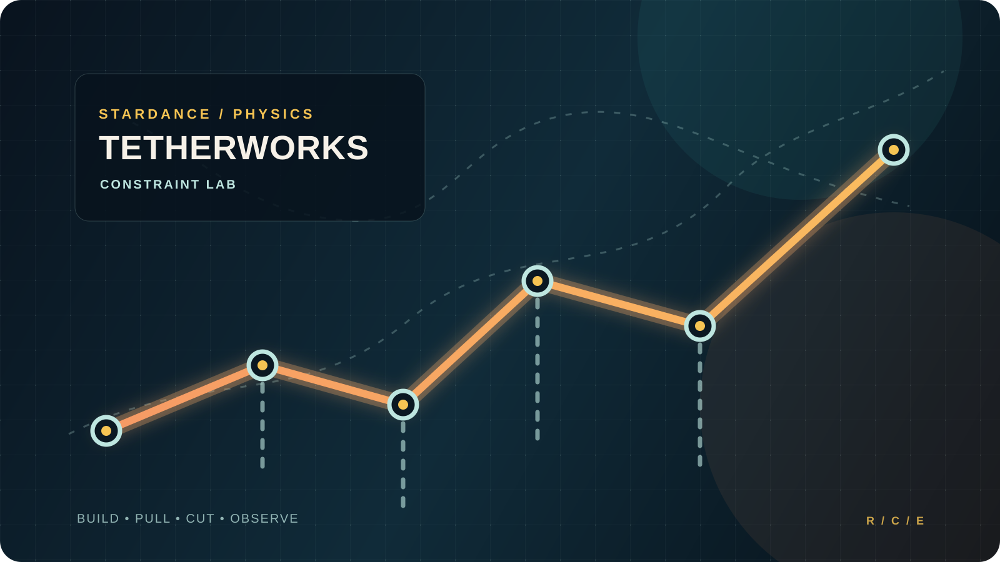
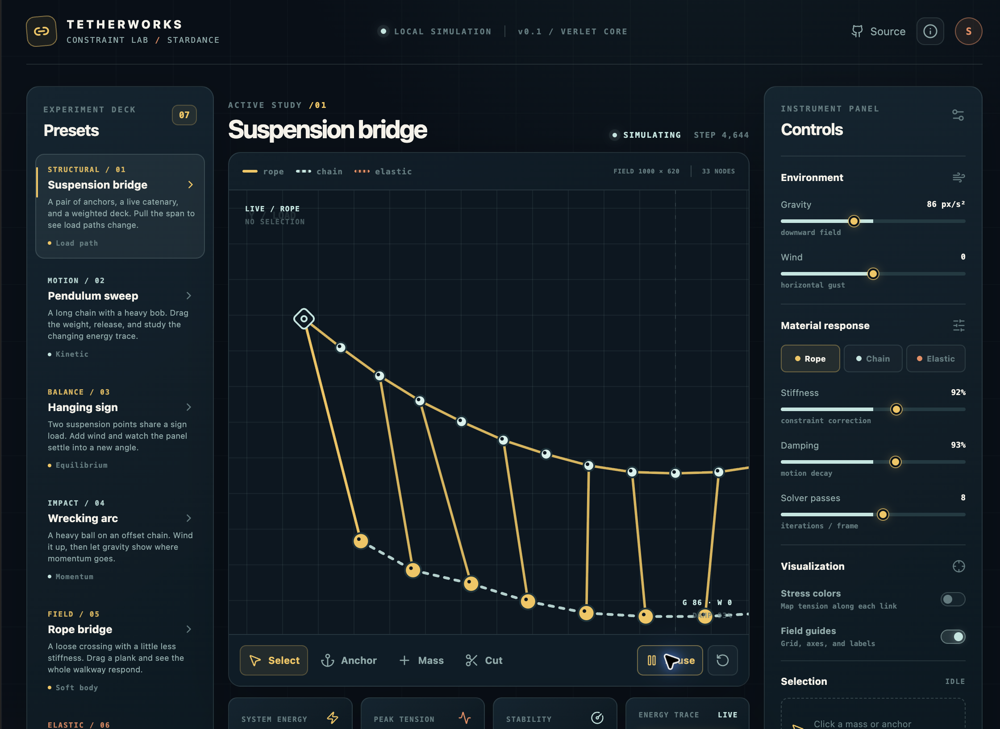

# Tetherworks: Constraint Lab

Tetherworks is a browser-based physics playground for curious hands. Build a rope, chain, spring, pendulum, bridge, sign, or small mechanical system, then pull on it and watch the constraints settle in real time.

**[Open the live lab →](https://costachestefy90-source.github.io/tetherworks-constraint-lab/)**





## What you can do

- Explore seven presets: suspension bridge, pendulum sweep, hanging sign, wrecking arc, rope bridge, spring system, and chain reaction.
- Drag mass nodes, create pinned anchor points, connect any two nodes, attach segmented masses, or cut constraints directly on the canvas.
- Select any mass to tune its weight live, pin it as a new anchor, release an anchor back into motion, or give it a quick impulse.
- Switch the active behavior between rope, chain, and elastic elements.
- Tune gravity, wind, damping, stiffness, solver passes, and the segment count used for new mass links while the simulation is running.
- Turn on stress colors to make high-tension links visible at a glance.
- Enable the failure redline to automatically break links that exceed a chosen load threshold.
- Toggle focus labels for quick node IDs, then use the inspector's Nudge action (or press `K`) to inject a measured impulse into a selected mass.
- Read system energy, peak tension, stability, center-of-mass movement, and a rolling energy trace.
- Use keyboard shortcuts: `Space` play/pause, `R` reset, `C` cut mode, `L` focus labels, `K` nudge, `P` pin/release, and `1`–`7` to load presets.

## Technical notes

The app is a static Vite + React + TypeScript frontend. There is no backend, database, API key, or runtime service.

The simulation core lives in [`src/physics.ts`](./src/physics.ts). It uses a small Verlet-style integrator:

1. Store the current and previous position for each node.
2. Integrate gravity and a time-varying wind field from the position delta.
3. Iterate distance constraints several times per frame, distributing correction by inverse mass.
4. Keep pinned nodes fixed and apply soft world bounds to prevent runaway values.
5. Estimate link tension, energy, and stability for the telemetry cards.

Rope and chain links go slack under compression; elastic links restore in both directions. Presets are data-building functions in [`src/presets.ts`](./src/presets.ts), so adding a mechanical study does not require changing the renderer or solver.

## Local development

```bash
npm install
npm run dev
```

Build and type-check the production bundle with:

```bash
npm run typecheck
npm run build
```

GitHub Pages deployment is defined in [`.github/workflows/deploy.yml`](./.github/workflows/deploy.yml) and runs on every push to `main`.

## Controls

| Control | Behavior |
| --- | --- |
| Select | Pause on grab, drag a mass, release it back into the solver |
| Anchor | Add a pinned point to the field |
| Link | Click two existing nodes to connect them with the active material |
| Mass | Add a weighted node and connect it to the nearest point using the selected segment count |
| Cut | Remove the nearest constraint under the cursor |
| Undo / `U` | Restore the last topology or material edit (up to 20 edits) |
| Gravity / Wind | Change the external field |
| Stiffness / Damping | Change constraint correction and motion decay |
| Solver passes | Trade speed for constraint tightness |
| Segment count | Set the number of links in a new mass attachment |
| Failure redline | Break a link automatically when its tension reaches the selected threshold |
| Focus labels | Show a readable node ID beside the hovered or selected point |
| Nudge / `K` | Apply a quick directional impulse to the selected mass |
| Pin / Release / `P` | Convert a selected mass into a fixed anchor, or release an anchor |
| Mass weight | Tune the selected mass between 0.5 kg and 12 kg |

## Project notes

The design direction and the five alternatives considered before implementation are recorded in [`docs/feature-directions.md`](./docs/feature-directions.md). The visual language is intentionally closer to a calm instrument panel than a game HUD: dark blueprint surfaces, warm load-path colors, and small monospace readouts keep the physics legible without hiding the playfulness.
